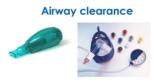
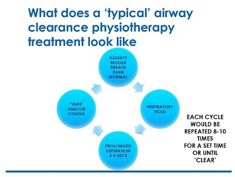

# Thanks for helping the Microsoft Fizzyo Challenge
----

Our hope is the Fizzyo device this will motivate children to do their physio every day and potentially help other families with Cystic Fibrosis as well!

If you are a game developer it’s as easy as 1-2-3.

The Fizzyo device appears as a Joystick on the computer, so you simply need to have your game interpret joystick inputs.

> ### Check the [README here](https://github.com/fizzyo-challenge/Fizzyo/) for more details on the currently supported platforms .
> but feel free to add your own engine / framework support.

----
### We allow for 2 types of inputs:

 - Breath – This appears as the Horizontal axis of the joystick, (float) returns breath strength from (-1 – 1) with 0 being not breathing, > 0.7 blowing or breathing out hard and < -0.5 breathing in hard
 
 - Button Press – We’ve added 1 button to the device to make game interactions a little more sophisticated. This button appears as Fire1 from a joystick control.

----
### If you are developing in [Unity](https://github.com/fizzyo-challenge/Fizzyo/Fizzyo-Unity/), you can use the following commands:

```
//(bool) Will return if the Fizzyo button is pressed or not.
bool buttonPressed = Fizzyo.FizzyoDevice.Instance().ButtonDown();

//Alternatively, you can get the button state directly using:
bool buttonPresed = Input.GetButtonDown("Fire1");

//(float) returns breath strength from (-1 – 1) with 0 being not breathing,
          > 0.7 blowing or breathing out hard and < -0.5 breathing in hard
float pressure = Fizzyo.FizzyoDevice.Instance().Pressure();

//Alternatively, you can get the axis data directly using:

float pressure = Input.GetAxis("Horizontal");
```

The benefit of using the functions from the device is that it allows you to use the pre-recorded data for testing, which will switch over to using live data by changing the *useRecordedData* parameter to false.

----
### If you are developing in [MonoGame](https://github.com/fizzyo-challenge/Fizzyo/Fizzyo-MonoGame/), you can use the following commands:

Grab the Fizzyo library from the sample and reference it in your project.

To capture if the button on the Fizzyo device
```
//(bool) Will return if the Fizzyo Device button is pressed or not.
bool buttonPresed = FizzyoDevice.ButtonDown(); 

//Or get the input direct from the gamePad:
bool buttonPresed = Keyboard.GetState().IsKeyDown(Keys.A);
```
To get the current blowing pressure from the Fizzyo device:
```
//(float) returns breath strength from (-1 – 1) with 0 being not breathing,
          > 0.7 blowing or breathing out hard and < -0.5 breathing in hard
float pressure = FizzyoDevice.Pressure();

//Or get the input direct from the gamePad:
float pressure = GamePad.GetState(0).ThumbSticks.Left.X;
```

With the MonoGame sample library, we also provide an InputManagement system, examine the sample in it's use.

----
### New BreathRecogniser control:

To help with detecting breath lengths / pressure and whether the player is blowing in to the Fizzyo device, a helper class has been provided.
Breath Analyser class decouples the logic of recognizing breaths from a stream of pressure samples from acting on the recognition.

To use:

1. Create an instance of BreathAnalyser, passing in the calibration values for MaxPressure and MaxBreathLength: 
```
    BreathAnalyser breathAnalyser = new BreathAnalyser(MaxPressure, MaxBreathLength);
```
2. Register for the ExhalationCompleteEvent: 
```
    breathAnalyser.ExhalationComplete += ExhalationCompleteHandler;
```
3. Add pressure samples in the update loop: 
```
    AddSample(Time.DeltaTime, pressure);
```
4. The event will fire at the end of an exhaled breath and provide information for:
    
       a) BreathLength
       b) BreathCount
       c) ExhaledVolume
       d) IsBreathGood
    
5. You can interrogate the breath analyser at any time to determine:
    
       a) BreathLength
       b) BreathCount
       c) ExhaledVolume
       d) IsExhaling
       e) MaxPressure
       f) MaxBreathLength
    
The algorithm for determining whether a breath is good or not is encapsulated in the method:
``` 
IsBreathGood()
```
This currently returns true if the average breath pressure and breath length is within 80% of the max.

----
## Typical Physio Sequence

- 9 - 10 cycles of the following routine
- Long slow breadth in until lungs are full (typically 2 sec depending on size of child)
- Hold the breadth 
- Exhale out active but not forced (typically 3 secs in length maintained velocity) 
- Then a huff/cough (the device is typically removed) This is forceful and the most important as its part of airway clearance (can this be used with your game)

----
## Game Types - think about the exercise

### Games children have suggested
- Bowling/firing a object (Breadth to charge)
- Geometry Dash/Flappy Bird (Jumping or movement)
- Angry Bird (Breadth to charge/fire)

----
## Game requirements

Keep in mind that we don’t want to force the children to blow to a certain pressure or for a certain amount of time. This is really up to the individual doing the exercises, we just want to detect a blow.

Designing a game for these limited interactions can be challenging! A good play pattern has been to use the blow to propel the character forward (at a constant speed) and the button to jump or fire a weapon.

In relation to output of the games from Health Hack we would like to implement a specific requirement / specification of games for use with the Fizzyo devices.

----
## Hardware and test data being provided

### Airway Clearance Physio Devices




- We will be making available 3 x Fizzyo PEP Engineering devices to hacker for testing of game content

- We will be making available 3 x Fizzyo Acepella Engineering devices to hacker for testing of game content

### Test Data from devices + Samples

- We have provided a Unity Sample Game which shows the input methods - see [Fizzyo-Unity-Example](https://github.com/ichealthhack/fizzyo-challenge/tree/master/Fizzyo-Unity-Example) Folder which contains pre calibration information, a sample game and test harness + test data

- We have provided a MonoGame Sample Game which shows the input methods - see [Fizzyo-Monogame-Example](https://github.com/ichealthhack/fizzyo-challenge/tree/master/Fizzyo-MonoGame-Example) Folder which contains pre calibration information, a sample game and test harness + test data
The MonoGame Project provides the FizzyoDevice classes in a separate PCL project, for easy use in your game together with a handy InputManagement system and the BreathAnalyser helper.

- We have provided Test Harnesses and sample data. The data data set of captured results from the devices are for games testing. This includes an example that allows you to load and playback breath data saved from a fizzyo device.

----
## How the Devices are used by Patients and how this should be related to game play

- Although getting a decent sized breath during inspiration is important – most of the focus is on expiration (this is the part where airway clearance is most effective).

- Inspiration is ‘free’ and un-resisted in all three techniques – while all 3 devices provide resistance against expiratory airflow 
(providing ‘positive expiratory pressure’ or PEP)

- PEP provides a consistent and measureable resistance against expiration

- Acapella and Flutter provide oscillatory resistance (Acapella with a magnetic lever and Flutter with a ball valve)

- Children aim for ‘active’ expiration rather than ‘relaxed or elastic recoil’ expiration(which is what happens normally). This means consistent, steady flow at a higher velocity than usual but not forced breathing.  

- Children aim for prolonged steady expiratory flow of at least 3s (although this may be a bit shorter in small children or those with severe disease who are breathless)

- The resistance in mid expiration for PEP should be 10-20cm H2O (ideally 12-15) measured by PEP manometer (in circuit) for mid-part of expiration.

----
## Physio Routine for children



- Treatments usually consistent of a series of ‘cycles’ – One cycle might typically include say 8-10 breaths through device (PEP & Acapella & Flutter ) as described above, followed by fewer but more forceful huffs (often not through the device- although some will huff through their PEP) and coughing as needed. The cycles are repeated until the chest feels clear. 

- Typical sessions should last no longer than 20 minutes.

- There needs to be a threshold for effort for an active blow (so that it doesn’t just respond to normal passive expiration) 

- It is important that we don’t incentivise more effort but do motivate for a longer blow, eg. acceleration could increase the longer the blow but definitely not accelerate with increased effort beyond the threshold trigger point.

----
## Useful videos on Patient physio and technique

- [Which is the best Airway Clearance method for Cystic Fibrosis?](https://www.youtube.com/watch?v=Wn5o5AgD9m0)
- [Cystic fibrosis breathing techniques – acapella device](https://www.youtube.com/watch?v=DJFp6A_p2R8)
- [Cystic fibrosis breathing techniques – positive expiratory pressure (PEP) mask](https://www.youtube.com/watch?v=C1SLdjvNg9U)

----
## Gaming, Cloud Services & Backend

- You will need to use [Unity3d] (http://www.unity3d.com) for you game development we want games for Android, iOS and Windows. 

- If your new to Unity you can build 2D or 3D games for the Fizzyo device [see] (https://unity3d.com/learn) for resources and tutorials.

- [Microsoft Azure](https://azure.microsoft.com)  

- If you develop any cloud services please ensure all necessary scripts, database schema and scripts are added to the github repo.

- If your new to Azure you watch this quick webinar [How to Get Started on Azure](https://info.microsoft.com/UK-MSFT-WBNR-FY17-11Nov-24-HowtoGetStartedonAzure-269444_Registration.html)

- Azure cloud services offer you the ability to add storage, game save, leaderboards, High Scores.

- [More Detail on Azure Cloud for Gaming](https://azure.microsoft.com/en-us/solutions/gaming/)

----
## Useful Resources for Cloud Gaming

### Service Fabric Opensource Gaming Framework
- [What is Service Fabric](https://azure.microsoft.com/en-us/services/service-fabric/)
- [Open Source Gaming Framework with scalable, SignalR gateway](https://github.com/SthlmTechAngels/GDC2017ServiceFabric) 
- [Unity Tanks demo, becomes multiplayer with Service Fabric](https://github.com/SthlmTechAngels/GDC2017Unity3d)

### Azure SDK and tools

- [Unity Azure SDK](https://github.com/Unity3dAzure)
- [Using App Services to Create a Leaderboard](http://www.deadlyfingers.net/azure/azure-app-services-for-unity3d/)
In future you can add Windows 10/Xbox Live Creators Update - - - [Add Xbox Gaming Features to your game - In Preview](https://developer.microsoft.com/en-us/games/xbox/xboxlive/creator)

----
## Visualisation and Charting using Microsoft PowerBI

A great tool for Visualisation and charting is [Microsoft PowerBI](http://www.powerbi.com) if your new to PowerBI or data visualisation then please watch this short webinar which wil give you an overview of data visualisation with [Power BI](https://info.microsoft.com/UK-MSFT-WBNR-FY17-12Dec-05-MicrosoftAzureBringyourDatatoLifePowerBIWebinar-269449_Registration.html)

----
## Game Deliverables

- All output fro  be under GNU open-source licensing and all entries stored within [this organisation](https://github.com/Fizzyo).

- All games should be ideally developed to become cross platform iOS, Android, Windows 10 and Windows Desktop the input for the game will use Phyiso equipment specially PEP and Acapella devices.

- Our recommendation is that Unity3D is preferred development tool due to extensive cross platform support.

- Games are intended for an age range of 4 – 18 year olds

- Games should ideally include a competitive element so multiple or compete based games

- Games should ideally include a leaderboard service to allow children to compete

- Games can have a chat aspect but ideally this should be done within controlled gaming environments such as google play, Xbox live or Apple Game Center to ensure privacy.

- Microsoft Azure Cloud services will be provided to all attendees to add cloud need services to the hack entries.

----
## Submission requirements for Github Repo

- A brief presentation on the purpose of your game and how to use it.

- Uploaded source control as per the requirements

- A live demo for judges to experience game app and ask questions 

- All code and scripting must be done during the time of the hackathon

- Existing Unity Assets from the asset store must be described and listed prior to judging and clearly listed as additional assets' with installation instructions on the GitHub repo

- Art assets such as pictures, picture libraries, 3d models or sound/music files are allowed but must be listed as such prior to judging and referenced within GitHub repo

- No copyrighted materials are submitted to GitHub repo

- Input from the pep devices should be mapped to Unity3D joystick controls

- Details of the games architecture and database schemas should be documented within the submissions

